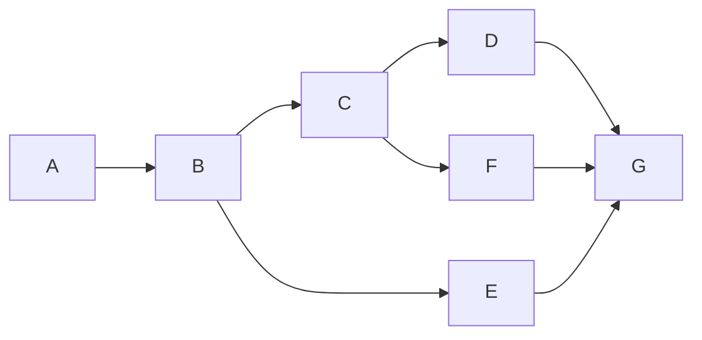
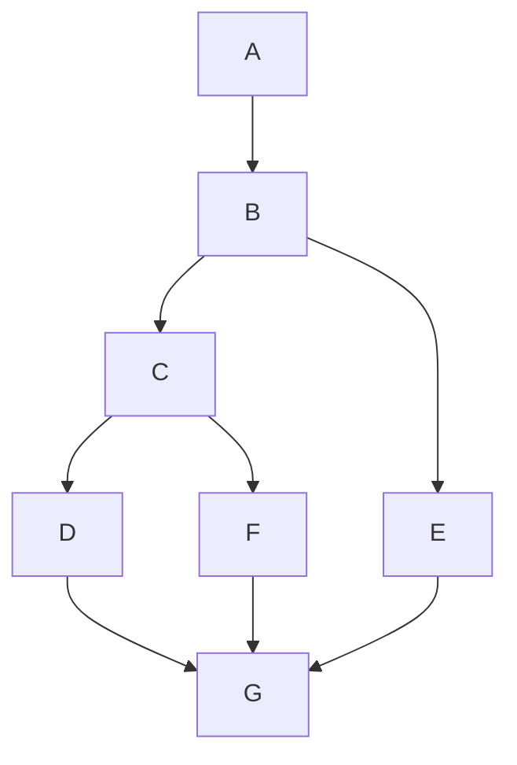

# Mermaid Diagram Linter

Validate Mermaid diagrams in markdown files for syntax errors, text overflow issues, and configuration requirements.

## When to Use

- Before deploying documentation sites
- When diagrams appear as raw code instead of rendered
- To validate diagram text length (prevents overflow)
- Part of documentation quality checks

## Validation Checks

### 1. Configuration Validation (mkdocs.yml)

Check that MkDocs is properly configured for enhanced markdown features.

**✅ RECOMMENDED: Native Integration (Material for MkDocs)**

Per [official Material docs](https://squidfunk.github.io/mkdocs-material/reference/diagrams/), native Mermaid integration requires ONLY the superfences extension:

```yaml
# Required in mkdocs.yml - Native integration
markdown_extensions:
  - pymdownx.superfences:
      custom_fences:
        - name: mermaid
          class: mermaid
          format: !!python/name:pymdownx.superfences.fence_code_format
  - pymdownx.emoji:
      emoji_index: !!python/name:material.extensions.emoji.twemoji
      emoji_generator: !!python/name:material.extensions.emoji.to_svg
  - attr_list          # Required for icon attributes { .lg .middle }
  - md_in_html         # Required for card grids and markdown in HTML

# NO extra_javascript needed - superfences handles it natively!
```

**⚠️ WARNING: Adding extra_javascript CDN can cause conflicts**

If you have this in your config, **remove it**:

```yaml
extra_javascript:
  - https://unpkg.com/mermaid@10/dist/mermaid.min.js  # ❌ NOT NEEDED
```

Material for MkDocs handles Mermaid natively. Adding the CDN manually can cause:

- Double initialization
- Version conflicts
- Theme styling issues

**Only add extra_javascript if:**

- Using custom Mermaid configuration (ELK layouts, etc.)
- Need specific Mermaid version for compatibility
- Using non-Material theme

If custom config is needed, use:

```yaml
extra_javascript:
  - javascripts/mermaid-config.js  # Your custom config
```

With `javascripts/mermaid-config.js`:

```javascript
import mermaid from 'https://cdn.jsdelivr.net/npm/mermaid@11/dist/mermaid.esm.min.mjs';
mermaid.initialize({ startOnLoad: false, securityLevel: 'loose' });
```

**Common Configuration Issues:**

| Missing Extension | Symptom | Fix |
|------------------|---------|-----|
| `custom_fences` | Mermaid renders as code blocks | Add superfences custom_fences |
| `pymdownx.emoji` | `:rocket:` shows as text | Add emoji extension |
| `attr_list` | Icon attributes not working | Add attr_list |
| `md_in_html` | Card grids show as raw text | Add md_in_html |

**Material for MkDocs Card Grids:**

Card grids require **BOTH** `attr_list` AND `md_in_html`:

```markdown
<div class="grid cards" markdown>

-   :material-rocket:{ .lg .middle } **Title**

    Description text

</div>
```

Without `md_in_html`, the markdown inside `<div>` tags won't be processed!

### 2. CSS Validation

Check for Mermaid overflow CSS in stylesheets:

```css
/* Required for proper rendering */
.mermaid {
  overflow-x: auto;
  text-align: center;
}

.mermaid svg {
  max-width: 100%;
  height: auto;
}

.mermaid .nodeLabel {
  font-size: 12px !important;
}
```

### 3. Syntax Validation

Per [official Mermaid docs](https://mermaid.js.org/syntax/flowchart.html), check each diagram for valid syntax:

**Diagram Types:**

- **Fully supported by Material theme:** `flowchart`, `sequenceDiagram`, `classDiagram`, `stateDiagram`, `erDiagram`
- **Work but no theme styling:** `graph`, `gantt`, `pie`, `journey`, `gitGraph`, `mindmap`, `quadrantChart`

**Direction Keywords:**

- `TB` or `TD` - Top to bottom (recommended for mobile)
- `BT` - Bottom to top
- `LR` - Left to right (simple linear flows only)
- `RL` - Right to left

**Critical Syntax Rules:**

1. **Reserved "end" keyword** - Must capitalize to avoid breaking diagram:

   ```mermaid
   flowchart TD
       A[Start] --> B[End]      ✅ Capitalized "End"
       A[Start] --> B[end]      ❌ BREAKS diagram
   ```

2. **First letter 'o' or 'x'** - Add space or capitalize:

   ```mermaid
   flowchart LR
       A --> oNode    ❌ Treated as circle edge
       A --> O_Node   ✅ Capitalize or use underscore
   ```

3. **Prefer `flowchart` over `graph`** - Both work identically, but `flowchart` is clearer intent

4. **All nodes must be connected** - Orphaned nodes cause syntax errors:

   ```mermaid
   flowchart TD
       A --> B
       C[Orphan]      ❌ Not connected to anything
   ```

### 4. Text Formatting Best Practices

Per [official Mermaid docs](https://mermaid.js.org/syntax/flowchart.html), use automatic text wrapping instead of manual line breaks.

**❌ AVOID: Manual `<br/>` tags**

```mermaid
flowchart TD
    A[Getting Started<br/>7 steps]    ❌ Manual breaks
    B[Intermediate<br/>11 steps]
```

**✅ RECOMMENDED: Markdown strings with automatic wrapping**

```mermaid
flowchart TD
    A["`**Getting Started**
    7 steps · 10 minutes
    Essential commands`"]           ✅ Auto-wraps, supports markdown
```

Markdown string syntax (backticks with quotes):

- Supports **bold**, *italic*, `code`
- Automatic text wrapping at node width
- More maintainable than `<br/>` tags
- Better mobile responsiveness

**Text Length Guidelines:**

| Element | Max Length | Recommendation |
|---------|------------|----------------|
| Node text (single line) | 15-20 chars | Use abbreviations, `...` for paths |
| Edge labels | 10 chars | Keep brief |
| Subgraph titles | 20 chars | Short descriptive names |

**Examples:**

```mermaid
%% BAD: Text too long, will overflow
graph LR
    A["~/.git-worktrees/aiterm/feature-mcp/"] --> B

%% GOOD: Abbreviated with markdown string
flowchart LR
    A["`**Worktrees**
    ~/.git-worktrees/
    .../feature-mcp`"] --> B["`Next Step`"]
```

### 5. Layout Direction Best Practices

**Prefer vertical layouts (TD/TB) over horizontal (LR/RL) for complex diagrams:**

| Layout | Best For | Avoid For |
|--------|----------|-----------|
| `flowchart TD` | Complex workflows, decision trees, multi-branch flows | - |
| `flowchart LR` | Simple linear flows (< 5 nodes), system architecture | Complex workflows, parallel processes |

**Why vertical layouts render better:**

- Better spacing on mobile/narrow screens
- Reduced text overlap in decision diamonds
- Clearer visualization of parallel processes using subgraphs
- More readable for ADHD-friendly documentation

**Examples:**





**When to use subgraphs (always with TD):**

- Parallel worktree workflows
- Multi-path decision flows
- Feature development pipelines

### 6. Diagram Count Report

Report all mermaid diagrams found:

- Total count per file
- Diagram types used
- Files with most diagrams
- Diagrams using `<br/>` tags (flag for modernization)

## Validation Commands

```bash
# Check all docs
grep -r "^\`\`\`mermaid" docs/ | wc -l

# Find diagrams using <br/> tags (should use markdown strings instead)
grep -r "<br/>" docs/**/*.md | grep -B5 mermaid

# Find long node text (> 20 chars between quotes)
grep -E '\["[^"]{20,}"\]' docs/**/*.md

# Check for custom_fences config
grep -A5 "superfences" mkdocs.yml | grep -q "custom_fences"

# Check for unnecessary extra_javascript (native integration doesn't need it)
grep -A3 "extra_javascript" mkdocs.yml | grep -q "mermaid"

# Find diagrams using deprecated 'graph' keyword
grep -A1 "^\`\`\`mermaid" docs/**/*.md | grep -c "^graph "
```

## Output Format

```
MERMAID DIAGRAM VALIDATION
==========================

Configuration:
  ✅ custom_fences configured in mkdocs.yml
  ✅ mermaid.js CDN in extra_javascript
  ⚠️  No Mermaid CSS found in stylesheets

Diagrams Found: 15 total
  docs/guides/GIT-WORKTREES-GUIDE.md: 12 diagrams
  docs/architecture/AITERM-ARCHITECTURE.md: 3 diagrams

Syntax Validation:
  ✅ All 15 diagrams have valid syntax

Text Length Issues:
  ⚠️  docs/guides/GIT-WORKTREES-GUIDE.md:156
      Node text "~/.git-worktrees/aiterm/feature-mcp/" is 38 chars (max 15)
      Suggestion: Use "~/.git-worktrees/.../feature-mcp"

Summary:
  Passed: 14/15
  Warnings: 1 (text length)
  Errors: 0 (syntax)
  Config: 2/3 (missing CSS)

Recommendations:
  1. Add Mermaid CSS to docs/stylesheets/extra.css
  2. Shorten node text in GIT-WORKTREES-GUIDE.md line 156
```

## Integration

**Called by:**

- `/craft:site:status --check` - Site health check
- `/craft:docs:validate` - Documentation validation
- `/craft:check commit` - Pre-commit checks

**Related:**

- `/craft:site:status` - Quick Mermaid config check
- `/craft:docs:generate` - Includes Mermaid guidelines

## Best Practices

Per [official Mermaid documentation](https://mermaid.js.org/syntax/flowchart.html) and [Material for MkDocs](https://squidfunk.github.io/mkdocs-material/reference/diagrams/):

1. **Use native integration** - Let Material handle Mermaid, don't add extra_javascript unless needed
2. **Markdown strings over `<br/>`** - Use backtick syntax for multi-line text with auto-wrapping
3. **Prefer `flowchart` keyword** - Clearer intent than `graph` (both work identically)
4. **Vertical layouts (TD)** - Better mobile rendering, reduced text overlap
5. **Capitalize "end" keyword** - Use "End" or "END" to avoid breaking diagrams
6. **Connect all nodes** - Orphaned nodes cause syntax errors
7. **Test locally** - Run `mkdocs serve` to preview diagrams before deployment
8. **Use subgraphs** - Group related nodes for clarity and structure
9. **Consistent diagram types** - Stick to one type per document (flowchart, sequence, etc.)
10. **Add comments** - Use `%%` for documentation within diagrams
11. **Keep it simple** - Avoid over-engineering, Swedish "lagom" principle applies

## Common Issues

| Issue | Cause | Fix |
|-------|-------|-----|
| Diagrams show as code | Missing custom_fences | Add superfences to mkdocs.yml |
| Diagram broken ("end" keyword) | Used lowercase "end" | Capitalize to "End" or "END" |
| Orphaned node error | Node not connected | Connect with arrow or remove |
| Text overflows boxes | Using `<br/>` tags | Switch to markdown strings with backticks |
| Double rendering | Extra_javascript + native | Remove extra_javascript, use native integration |
| Poor mobile rendering | Horizontal (LR) layout | Switch to vertical (TD) layout |
| Theme colors not applied | Using unsupported diagram type | Use flowchart/sequence/class/state/ER only |
| Syntax error on 'o' or 'x' | First letter treated as edge | Capitalize or add space before name |
