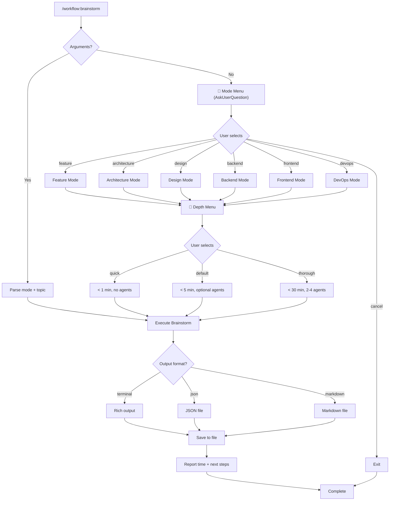

# /workflow:brainstorm - Enhanced Brainstorm

ADHD-friendly brainstorming with smart mode detection, time budgets, and agent delegation.

## Arguments

| Argument | What it does |
|----------|--------------|
| (none) | Show interactive mode menu |
| `feature` | User stories, MVP scope, acceptance criteria |
| `architecture` | System design, scalability, component diagrams |
| `design` | UI/UX wireframes, accessibility, user flows |
| `backend` | API endpoints, database schema, auth patterns |
| `frontend` | Component tree, state management, performance |
| `devops` | CI/CD pipelines, deployment, infrastructure |
| `quick` | < 1 min, 5-7 ideas, no agents |
| `thorough` | < 30 min, 2-4 agents for deep analysis |

## When Invoked

### Step 0: Parse Arguments

Check if user provided a mode argument:

```
Arguments provided? → Skip to Step 2 with that mode
No arguments? → Show mode selection menu (Step 1)
```

### Step 1: Tab-Completion Menu (No Arguments)

When user types `/brainstorm` and presses `Tab`, show a sub-command menu:

```
/brainstorm [Tab]

┌─────────────────────────────────────────────────────────────────┐
│ ── Depth ──────────────────────────────────────────────────────│
│ ▸ default (Recommended)  (< 5 min)  → Comprehensive analysis    │
│   quick                  (< 1 min)  → Fast ideation, no agents  │
│   thorough               (< 30 min) → Deep analysis with agents │
│ ── Content Mode ───────────────────────────────────────────────│
│   feature                           → User stories, MVP scope   │
│   architecture                      → System design, diagrams   │
│   design                            → UI/UX wireframes, flows   │
│   backend                           → API, database, auth       │
│   frontend                          → Components, state mgmt    │
│   devops                            → CI/CD, deployment         │
├─────────────────────────────────────────────────────────────────┤
│ ↑↓ Navigate  ⏎ Select (appends)  Tab Continue  Esc Cancel       │
└─────────────────────────────────────────────────────────────────┘
```

#### Menu Spec

| Spec | Value |
|------|-------|
| **Trigger** | `/brainstorm` + `Tab` |
| **Order** | Depth first (with headers), then Content Modes |
| **Default** | `default (Recommended)` at top, pre-selected |
| **Format** | `name (time) → description` |
| **Selection** | Appends to command line |
| **Multi-select** | Yes, press Tab again to add more options |

#### Navigation

| Key | Action |
|-----|--------|
| `↑` / `↓` | Navigate between options |
| `Enter` | Select and append to command line |
| `Tab` | Show menu again (for combining depth + mode) |
| `Esc` | Close menu, keep current command |

#### Example Workflow

```
/brainstorm [Tab]           → Shows menu, 'default' pre-selected
  ↓ (arrow down)            → Highlight 'quick'
  Enter                     → Command becomes: /brainstorm quick
  [Tab]                     → Shows menu again (modes available)
  ↓↓↓ (to 'feature')        → Highlight 'feature'
  Enter                     → Command becomes: /brainstorm quick feature
  Type " auth"              → Command becomes: /brainstorm quick feature auth
  Enter                     → Executes brainstorm
```

#### Fallback (If Tab-Completion Unavailable)

If tab-completion is not supported, use AskUserQuestion:

```
Question: "What type of brainstorming?"
Header: "Mode"
Options: [depth options, then content mode options]
```

---

## ⏱️ Time Budget Guarantees

| Depth | Time Budget | Delegation | Output |
|-------|-------------|------------|--------|
| **quick** | < 60s (MUST) | None | 5-7 ideas, quick wins |
| **default** | < 300s (SHOULD) | Optional | Comprehensive with options |
| **thorough** | < 1800s (MAX) | 2-4 agents | Deep analysis with synthesis |

---

### Step 2: Gather Context

If topic not provided, analyze conversation context:

```bash
# Detect project type
ls DESCRIPTION package.json pyproject.toml go.mod 2>/dev/null

# Get current directory context
pwd
git branch --show-current 2>/dev/null
```

### Step 3: Execute Brainstorm

Based on selected mode + depth:

---

#### Mode: Feature

**Focus:** User value, functionality, MVP scope
**Default Depth:** default (< 5 min)
**Agent (thorough):** product-strategist

Output includes:
- User stories with acceptance criteria
- MVP vs Nice-to-have split
- Quick wins vs Long-term features
- Recommended implementation order

---

#### Mode: Architecture

**Focus:** System design, scalability, technical trade-offs
**Default Depth:** default or thorough
**Agents (thorough):** backend-architect, database-architect

Output includes:
- Component diagram (Mermaid)
- Data flow analysis
- Scalability considerations
- Trade-offs table

---

#### Mode: Design

**Focus:** UI/UX, accessibility, user experience
**Default Depth:** default
**Agent (thorough):** ux-ui-designer

Output includes:
- Wireframes (ASCII art)
- Component structure
- Accessibility checklist
- User flow diagram

---

#### Mode: Backend

**Focus:** API design, database schema, auth patterns
**Default Depth:** default
**Agents (thorough):** backend-architect, security-specialist

Output includes:
- API endpoints
- Schema design
- Security checklist
- Integration patterns

---

#### Mode: Frontend

**Focus:** Component architecture, state management, performance
**Default Depth:** default
**Agents (thorough):** frontend-specialist, performance-engineer

Output includes:
- Component tree
- State management strategy
- Bundle optimization
- Performance budget

---

#### Mode: DevOps

**Focus:** CI/CD, deployment, infrastructure
**Default Depth:** quick or default
**Agent (thorough):** devops-engineer

Output includes:
- Deployment pipeline
- Platform recommendations
- Cost estimates
- Monitoring strategy

---

### Step 4: Format Output

**Terminal Format (Default):**
```
┌─────────────────────────────────────────────────────────────┐
│ 🧠 BRAINSTORM: [Topic]                                      │
│ Mode: [mode] │ Depth: [depth] │ Duration: [time]            │
├─────────────────────────────────────────────────────────────┤
│                                                             │
│ ## Quick Wins (< 30 min each)                               │
│   ⚡ [Action 1] - [Benefit]                                  │
│   ⚡ [Action 2] - [Benefit]                                  │
│                                                             │
│ ## Medium Effort (1-2 hours)                                │
│   □ [Task with clear outcome]                               │
│                                                             │
│ ## Long-term (Future sessions)                              │
│   □ [Strategic item]                                        │
│                                                             │
│ ## Recommended Path                                         │
│   → [Clear recommendation with reasoning]                   │
│                                                             │
├─────────────────────────────────────────────────────────────┤
│ ✅ Completed in [time]s (within [depth] budget)             │
└─────────────────────────────────────────────────────────────┘
```

**JSON Format (`--format json`):**
```json
{
  "metadata": {
    "timestamp": "2024-12-24T10:30:00Z",
    "mode": "feature",
    "depth": "quick",
    "duration_seconds": 45,
    "agents_used": []
  },
  "content": {
    "topic": "User notifications",
    "quick_wins": [],
    "medium_effort": [],
    "long_term": []
  },
  "recommendations": {
    "recommended_path": "...",
    "next_steps": []
  }
}
```

**Markdown Format (`--format markdown`):**
Saves to `BRAINSTORM-[topic]-[date].md`

---

### Step 5: Save & Show Results

Always save output to file:
- **Location:** Project root or `~/brainstorms/`
- **Filename:** `BRAINSTORM-[topic]-[date].md` or `.json`

Show footer:
```
┌─────────────────────────────────────────────────────────────┐
│ ✅ Done: [summary of brainstorm]                            │
├─────────────────────────────────────────────────────────────┤
│                                                             │
│ 💡 Quick tip:                                               │
│    /workflow:brainstorm quick auth  ← skip menu             │
│                                                             │
│ 🔗 Related commands:                                        │
│    /workflow:focus       ← start focused work               │
│    /workflow:next        ← get next step                    │
│    /workflow:done        ← complete session                 │
│                                                             │
│ 📄 Files:                                                   │
│    BRAINSTORM-[topic]-[date].md  ← saved output             │
│                                                             │
└─────────────────────────────────────────────────────────────┘
```

---

## Agent Delegation (Thorough Mode)

When depth is `thorough`, launch relevant agents in background:

```python
# When thorough mode is active
if depth == "thorough":
    # Launch agents in background (non-blocking)
    backend_analysis = Task(
        subagent_type="backend-architect",
        prompt="Analyze backend architecture for [topic]",
        run_in_background=True,
        description="Backend analysis"
    )

    ux_analysis = Task(
        subagent_type="ux-ui-designer",
        prompt="Review UX design for [topic]",
        run_in_background=True,
        description="UX analysis"
    )

    # Continue with initial brainstorm while agents work
    initial_ideas = generate_initial_ideas()

    # Wait for agents to complete, then synthesize
    backend_results = TaskOutput(backend_analysis.task_id, block=True, timeout=1200000)
    ux_results = TaskOutput(ux_analysis.task_id, block=True, timeout=1200000)

    # Synthesize comprehensive plan
    synthesize_comprehensive_plan(initial_ideas, backend_results, ux_results)
```

### Agent Selection by Mode

| Mode | Agents Launched |
|------|-----------------|
| feature | product-strategist |
| architecture | backend-architect, database-architect |
| design | ux-ui-designer |
| backend | backend-architect, security-specialist |
| frontend | frontend-specialist, performance-engineer |
| devops | devops-engineer |

---

## Examples

### Example 1: Interactive Mode Selection

```
User: /workflow:brainstorm

Claude: Shows mode menu...
User: Selects "Feature (Recommended)"

Claude: Shows depth menu...
User: Selects "Quick (Recommended)"

Claude: "What topic would you like to brainstorm?"
User: "user authentication"

→ Runs feature + quick brainstorm for auth
→ Completes in 42s
→ Saves to BRAINSTORM-user-auth-2024-12-24.md
```

### Example 2: Direct Invocation (Skip Menu)

```
User: /workflow:brainstorm quick feature auth

→ Skips menus entirely
→ Runs feature mode with quick depth
→ Completes in 38s
```

### Example 3: Thorough Architecture Analysis

```
User: /workflow:brainstorm thorough architecture "multi-tenant SaaS"

→ Launches backend-architect agent (background)
→ Launches database-architect agent (background)
→ Generates initial ideas while agents work
→ Synthesizes comprehensive plan
→ Completes in 3m 24s
→ Saves detailed analysis with agent findings
```

### Example 4: JSON Output

```
User: /workflow:brainstorm feature notifications --format json

→ Runs feature brainstorm
→ Outputs JSON structure
→ Saves to BRAINSTORM-notifications-2024-12-24.json
```

---

## Mode Selection Flowchart



---

## v2.1 Changes

**New in v2.1:**
- ✅ Interactive menu-based UX (matches craft plugin pattern)
- ✅ Two-step mode selection (content mode + depth)
- ✅ Separated "depth" from "mode" for clarity
- ✅ Cancel option via "Other"
- ✅ Quick tip showing direct invocation
- ✅ Related commands in footer

**Backward Compatible:**
- ✅ All v2.0 direct invocations work unchanged
- ✅ `quick` and `thorough` still work as modes
- ✅ Default behavior preserved

**Migration:**
```bash
# v2.0 (still works)
/workflow:brainstorm                    → Shows menu (v2.1 enhanced)
/workflow:brainstorm quick              → Quick mode directly
/workflow:brainstorm thorough           → Thorough mode directly
/workflow:brainstorm feature auth       → Feature mode for auth

# v2.1 (new)
/workflow:brainstorm                    → Mode menu → Depth menu → Topic
/workflow:brainstorm quick feature auth → Explicit depth + mode + topic
```

---

## Integration

**Part of workflow command family:**
- `/workflow:brainstorm` - Brainstorm ideas ← this command
- `/workflow:focus` - Start focused work session
- `/workflow:next` - Get next step
- `/workflow:stuck` - Get unstuck help
- `/workflow:done` - Complete session

**Uses:**
- AskUserQuestion for mode and depth selection
- Task tool for agent delegation (thorough mode)
- Write tool for saving output
- Read tool for context gathering
