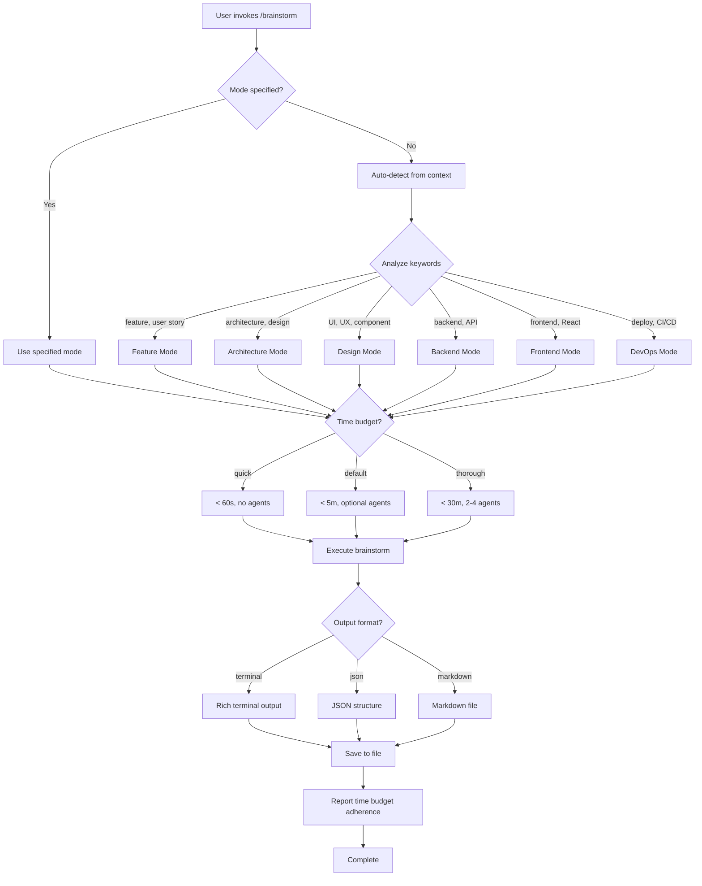

# Enhanced Brainstorm Command v2.0

**Usage:**
```bash
/brainstorm                          # Auto-detect mode, terminal output
/brainstorm feature                  # Feature brainstorm mode
/brainstorm architecture             # Architecture design mode
/brainstorm design                   # UI/UX design mode
/brainstorm quick                    # Quick ideation (< 1 min, no delegation)
/brainstorm thorough "API design"    # Deep analysis with agents (< 30 min)
/brainstorm --format json            # Output as JSON
/brainstorm --format markdown        # Output as markdown
```

---

## ⏱️ Performance Guarantees (v2.0)

**Mode System with Time Budgets:**

| Mode | Time Budget | Delegation | Output | Use When |
|------|-------------|------------|--------|----------|
| **quick** | < 60s (MUST) | None | 5-7 ideas, quick wins | Fast decisions, familiar topics |
| **default** | < 300s (SHOULD) | Optional | Comprehensive with options | Daily brainstorming |
| **thorough** | < 1800s (MAX) | 2-4 agents | Deep analysis with synthesis | Architecture decisions, unfamiliar domains |

**Content Modes (apply to any time budget):**
- **feature** - User value, MVP scope, user stories
- **architecture** - System design, scalability, trade-offs
- **design** - UI/UX, accessibility, user experience
- **backend** - API design, database, auth patterns
- **frontend** - Components, state management, performance
- **devops** - CI/CD, deployment, infrastructure

**Combining Modes:**
```bash
/brainstorm quick feature auth           # Feature mode, quick time budget
/brainstorm thorough architecture oauth  # Architecture mode, deep analysis
/brainstorm design dashboard             # Design mode, default time budget
```

---

## 🎨 Output Formats (v2.0)

### Terminal Format (Default)
- Rich colors and emojis
- Scannable headers and bullets
- ADHD-friendly structure
- Interactive save prompt

### JSON Format
```json
{
  "metadata": {
    "timestamp": "2024-12-24T10:30:00Z",
    "mode": "feature",
    "time_budget": "quick",
    "duration_seconds": 45,
    "agents_used": []
  },
  "content": {
    "topic": "User notifications",
    "quick_wins": [
      {"action": "Email notifications", "benefit": "Easy to implement", "effort": "< 30 min"}
    ],
    "medium_effort": [
      {"task": "In-app notifications", "outcome": "Better UX", "effort": "1-2 hours"}
    ],
    "long_term": [
      {"item": "Push notifications (mobile)", "strategic_value": "Mobile engagement"}
    ]
  },
  "recommendations": {
    "recommended_path": "Start with email notifications...",
    "next_steps": [
      "Set up email service (SendGrid/Mailgun)",
      "Create notification templates",
      "Add user notification preferences"
    ]
  }
}
```

### Markdown Format
```markdown
# User Notifications Brainstorm

**Generated:** 2024-12-24 10:30
**Mode:** feature (quick)
**Duration:** 45 seconds

## Quick Wins (< 30 min each)
- ⚡ Email notifications - Easy to implement
- ⚡ Basic templates - Reusable patterns

## Medium Effort (1-2 hours)
- [ ] In-app notifications
- [ ] User preferences UI

## Recommended Path
→ Start with email notifications using SendGrid...

## Next Steps
1. [ ] Set up email service
2. [ ] Create templates
3. [ ] Add preferences
```

---

## How It Works

### 1. Smart Mode Detection

If no mode specified, I analyze the conversation context to detect:

| Keywords Detected | Mode Selected | Delegation |
|------------------|---------------|------------|
| "feature", "functionality", "user story" | `feature` | Product strategist agent (background) |
| "architecture", "system design", "scalability" | `architecture` | Backend architect agent (background) |
| "UI", "UX", "design", "layout", "accessibility" | `design` | UX/UI designer agent (background) |
| "backend", "API", "database" | `backend` | Backend architect + database architect |
| "frontend", "component", "React" | `frontend` | Frontend specialist + UX designer |
| "deployment", "CI/CD", "Docker" | `devops` | DevOps engineer agent |

### 2. Time Budget Enforcement

```python
import time

def brainstorm(topic, mode="default", time_budget=300):
    """
    Enforce time budgets with warnings.

    Time budgets:
    - quick: 60s (MUST - strict requirement)
    - default: 300s (SHOULD - flexible target)
    - thorough: 1800s (MAX - absolute limit)
    """
    start_time = time.time()

    try:
        # Execute brainstorm logic
        result = execute_brainstorm(topic, mode)

    finally:
        elapsed = time.time() - start_time

        # Report time budget adherence
        if mode == "quick" and elapsed > 60:
            print(f"⚠️  Quick mode exceeded 60s budget ({elapsed:.1f}s)")
        elif mode == "default" and elapsed > 300:
            print(f"⚠️  Default mode exceeded 5m budget ({elapsed:.1f}s)")
        elif mode == "thorough" and elapsed > 1800:
            print(f"⚠️  Thorough mode exceeded 30m budget ({elapsed:.1f}s)")
        else:
            print(f"✅ Completed in {elapsed:.1f}s (within {mode} budget)")

    return result
```

### 3. Brainstorm Execution

**Quick Mode** (< 1 minute):
1. Pattern recognition from skills
2. Generate 5-7 concrete ideas
3. Organize by Quick Wins vs Long-term
4. Provide next steps
5. Save to file

**Default Mode** (< 5 minutes):
1. Smart mode detection
2. Generate comprehensive options
3. Optional agent delegation for complex topics
4. Trade-off analysis
5. Recommended path
6. Save detailed document

**Thorough Mode** (< 30 minutes):
1. Generate initial ideas
2. **Delegate deep analysis to 2-4 agents** (background):
   - Launch relevant agents based on topic
   - Agents run in parallel (non-blocking)
   - Monitor progress, provide updates
3. **Synthesize agent findings** into comprehensive plan
4. Save detailed brainstorm document with:
   - Multiple approaches with trade-offs
   - Agent analysis summaries
   - Recommended path forward
   - Implementation timeline

### 4. Output Structure

All brainstorms follow ADHD-friendly format:

```markdown
# [Topic] Brainstorm

**Generated:** [Date]
**Mode:** [Detected Mode] ([Time Budget])
**Duration:** [Actual Time]
**Agents Consulted:** [Agent list if thorough mode]
**Format:** [terminal|json|markdown]

## Quick Wins (< 30 min each)
1. ⚡ [Action] - [Benefit]
2. ⚡ [Action] - [Benefit]

## Medium Effort (1-2 hours)
- [ ] [Task with clear outcome]

## Long-term (Future sessions)
- [ ] [Strategic item]

## Agent Analysis (Thorough mode only)

### Backend Architect Analysis
[Summary of agent findings]

### UX Designer Analysis
[Summary of agent findings]

## Recommended Path
→ [Clear recommendation with reasoning]

## Next Steps
1. [ ] [Immediate action]
2. [ ] [Follow-up]
```

---

## Mode-Specific Behaviors

### Feature Mode
**Focus:** User value, functionality, MVP scope
**Time Budget:** Default (< 5 min)
**Delegation:** Product strategist agent (thorough mode)
**Output:** User stories, acceptance criteria, scope definition

### Architecture Mode
**Focus:** System design, scalability, technical trade-offs
**Time Budget:** Default or thorough (< 5-30 min)
**Delegation:** Backend architect + database architect (parallel)
**Output:** Architecture diagrams (Mermaid), component breakdown, data flow

### Design Mode
**Focus:** UI/UX, accessibility, user experience
**Time Budget:** Default (< 5 min)
**Delegation:** UX/UI designer agent (thorough mode)
**Output:** Wireframes (ASCII art), component structure, a11y checklist

### Backend Mode
**Focus:** API design, database schema, auth patterns
**Time Budget:** Default (< 5 min)
**Delegation:** Backend architect + security specialist (thorough mode)
**Output:** API endpoints, schema design, security checklist

### Frontend Mode
**Focus:** Component architecture, state management, performance
**Time Budget:** Default (< 5 min)
**Delegation:** Frontend specialist + performance engineer (thorough mode)
**Output:** Component tree, state management strategy, bundle optimization

### DevOps Mode
**Focus:** CI/CD, deployment, infrastructure
**Time Budget:** Quick or default (< 1-5 min)
**Delegation:** DevOps engineer agent (thorough mode)
**Output:** Deployment pipeline, platform recommendations, cost estimates

---

## Agent Delegation System

### Background Execution
```python
# When thorough mode is active
if mode == "thorough" or detected_complexity == "high":
    # Launch agents in background (non-blocking)
    backend_analysis = Task(
        subagent_type="backend-architect",
        prompt="Analyze backend architecture for [topic]",
        run_in_background=True,
        description="Backend analysis"
    )

    ux_analysis = Task(
        subagent_type="ux-ui-designer",
        prompt="Review UX design for [topic]",
        run_in_background=True,
        description="UX analysis"
    )

    # Continue with initial brainstorm while agents work
    initial_ideas = generate_initial_ideas()

    # Wait for agents to complete, then synthesize
    backend_results = TaskOutput(backend_analysis.task_id, block=True, timeout=1200000)  # 20 min
    ux_results = TaskOutput(ux_analysis.task_id, block=True, timeout=1200000)

    # Synthesize comprehensive plan
    synthesize_comprehensive_plan(initial_ideas, backend_results, ux_results)
```

### Agent Selection Logic

I automatically select agents based on topic keywords:

| Topic Contains | Agents Launched |
|---------------|----------------|
| "API", "backend", "database" | backend-architect, database-architect |
| "UI", "UX", "component" | ux-ui-designer, frontend-specialist |
| "deploy", "CI/CD", "infrastructure" | devops-engineer |
| "auth", "security", "permissions" | security-specialist |
| "performance", "optimization" | performance-engineer |
| "test", "quality", "coverage" | testing-specialist |

---

## Integration with Skills

This command works seamlessly with auto-activating skills:

- **backend-designer** skill provides quick backend recommendations
- **frontend-designer** skill offers UX patterns
- **devops-helper** skill suggests deployment strategies

**Workflow:**
1. User invokes `/brainstorm`
2. Skills auto-activate based on topic keywords
3. Skills provide immediate patterns/recommendations
4. If thorough mode, command delegates to agents for deep analysis
5. Final output combines skill patterns + agent analysis

---

## File Output

All brainstorms are automatically saved to:

**Location:** Current project root or `~/brainstorms/`
**Filename:** `BRAINSTORM-[topic]-[date].md` (terminal/markdown) or `.json` (json format)

**Example:** `BRAINSTORM-user-authentication-2024-12-24.md`

After saving, I ask: "Would you like me to open this file?" and use AppleScript to open in iA Writer (markdown) or default JSON viewer.

---

## Examples

### Example 1: Quick Feature Brainstorm

```
User: "/brainstorm quick feature user notifications"

Response:
⏱️  Mode: feature (quick) - Target: < 60 seconds

1. Quick pattern recognition (feature mode detected)
2. backend-designer skill auto-activates
3. Generate 5 notification approaches
4. List quick wins (email notifications) vs long-term (push, SMS)
5. Save to BRAINSTORM-user-notifications-2024-12-24.md
6. Ask to open file

✅ Completed in 42s (within quick budget)
```

### Example 2: Thorough Architecture Brainstorm with JSON Output

```
User: "/brainstorm thorough architecture multi-tenant SaaS --format json"

Response:
⏱️  Mode: architecture (thorough) - Target: < 30 minutes

1. Architecture mode detected
2. Launch backend-architect agent (background)
3. Launch database-architect agent (background)
4. Generate initial architecture options
5. Wait for agents to complete (~2-3 min)
6. Synthesize comprehensive plan with:
   - Database isolation strategies (schema vs database)
   - API design (tenant context, authorization)
   - Scalability considerations
   - Cost estimates
7. Save to BRAINSTORM-multi-tenant-architecture-2024-12-24.json
8. Display JSON structure

✅ Completed in 3m 24s (within thorough budget)
```

### Example 3: Auto-Detected Design Brainstorm

```
User: "/brainstorm I need to improve the dashboard UX"

Response:
⏱️  Mode: design (default) - Target: < 5 minutes

1. Auto-detect design mode (keywords: "dashboard", "UX")
2. frontend-designer skill auto-activates
3. Generate UX patterns (card layout, data visualization)
4. Provide accessibility checklist
5. ADHD-friendly design tips
6. Save comprehensive design brainstorm

✅ Completed in 2m 18s (within default budget)
```

---

## Tips for Best Results

**Be specific:** "User authentication with OAuth" > "auth stuff"

**Mention constraints:** "Budget: $50/month", "Team: 2 developers", "Timeline: 1 week MVP"

**Include context:** "Existing stack: Next.js, PostgreSQL, Vercel"

**Use thorough mode when:**
- Multiple valid approaches exist
- Architecture decisions with long-term impact
- Unfamiliar domain/technology
- Need detailed analysis before committing

**Use quick mode when:**
- Time-sensitive decisions
- Familiar territory
- Just need validation of approach
- Exploring initial ideas

**Use default mode when:**
- Daily brainstorming needs
- Balanced depth and speed
- Most common use case

---

## Mode Selection Flowchart



---

## v2.0 Changes

**New Features:**
- ✅ Explicit time budgets (quick < 60s, default < 300s, thorough < 1800s)
- ✅ Time budget enforcement with warnings
- ✅ Format handlers (terminal, json, markdown)
- ✅ Performance guarantees (MUST for quick, SHOULD for default, MAX for thorough)
- ✅ Improved mode documentation

**Backward Compatible:**
- ✅ All v1.0 commands work unchanged
- ✅ Default behavior preserved
- ✅ No breaking changes

**Migration:**
```bash
# v1.0 (still works)
/brainstorm                     → Uses default mode (< 5 min)
/brainstorm quick              → Uses quick mode (< 1 min)
/brainstorm thorough           → Uses thorough mode (< 30 min)

# v2.0 (new features)
/brainstorm --format json      → JSON output
/brainstorm --format markdown  → Markdown output
/brainstorm quick feature auth → Explicit mode + time budget
```

---

**Remember:** This command enhances the existing `/brainstorm` workflow with smart detection, time budgets, format options, and automatic delegation. It maintains ADHD-friendly output (scannable, actionable, quick wins) while providing deep analysis when needed, with guaranteed performance budgets.
