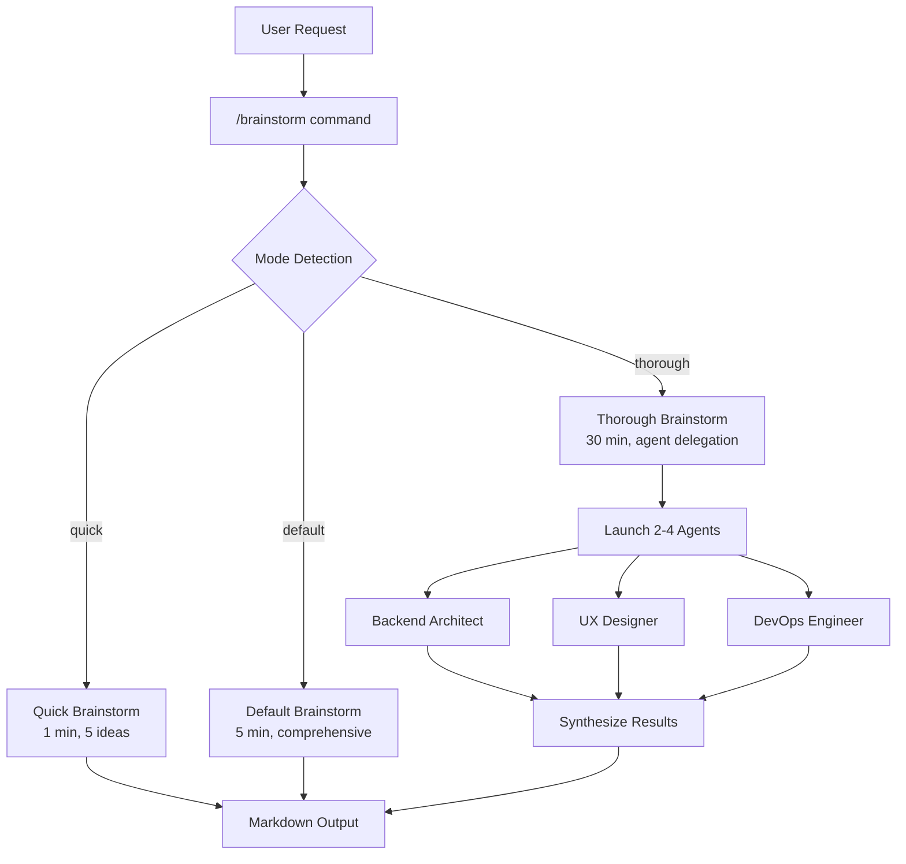
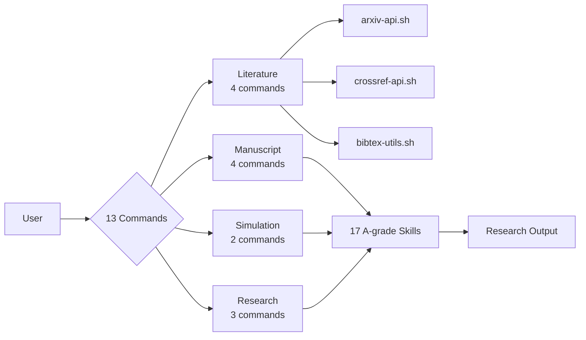

# Workflow & Statistical-Research Plugin Improvements

**Date:** 2024-12-24
**Based on:** RForge Mode System success patterns
**Status:** Recommendations for Phase 2 enhancements

---

## Executive Summary

After successfully implementing a comprehensive mode system, testing infrastructure, and CI/CD automation for RForge (96 tests, 9 CI/CD jobs, 14 docs), similar improvements can dramatically enhance the **workflow** and **statistical-research** plugins.

### Current State Assessment

| Plugin | Commands | Skills | Tests | CI/CD | Docs | Planning |
|--------|----------|--------|-------|-------|------|----------|
| **workflow** | 1 | 3 skills | ✅ Basic (1 bash) | ⚠️ Shared only | ✅ Good (README, QUICK-START, REFCARD) | ❌ None |
| **statistical-research** | 13 | 17 A-grade skills | ✅ Basic (1 bash) | ⚠️ Shared only | ✅ Good (README, QUICK-START, REFCARD) | ❌ None |
| **rforge** | 5 | 1 agent | ✅ **96 pytest** | ✅ **Dedicated (9 jobs)** | ✅ **Comprehensive (14 files)** | ✅ **Complete** |

**Key Insight from RForge:**
> Documentation-first approach with comprehensive testing infrastructure before feature expansion prevents confusion and accelerates development.

---

## 🎯 Priority 1: Essential Improvements (Week 1)

### 1.1 Mode System for Workflow Plugin

**Problem:** `/brainstorm` command has modes but lacks performance guarantees and time budgets

**RForge Pattern Applied:**
```yaml
# Current workflow modes (implicit)
- quick: 5-10 minutes
- thorough: 10-30 minutes

# Proposed with RForge pattern:
modes:
  quick:
    time_budget: 60  # 1 minute MUST
    delegation: false
    output: "5-7 ideas, quick wins"

  default:
    time_budget: 300  # 5 minutes SHOULD
    delegation: optional
    output: "comprehensive with options"

  thorough:
    time_budget: 1800  # 30 minutes MAX
    delegation: true (2-4 agents)
    output: "deep analysis with agent synthesis"
```

**Implementation:**
- [ ] Update `/brainstorm` command with explicit time budgets
- [ ] Add `--format` option (terminal, json, markdown)
- [ ] Document mode selection flowchart
- [ ] Add timeout enforcement

**Benefit:** Users know exactly how long brainstorming will take

---

### 1.2 Mode System for Statistical-Research Commands

**Problem:** 13 commands with no performance guarantees or mode variations

**High-Impact Commands for Modes:**

#### `/research:arxiv` Modes
```yaml
quick:
  time_budget: 30  # seconds
  max_results: 5
  fields: [title, authors, abstract]

default:
  time_budget: 120  # 2 minutes
  max_results: 20
  fields: [title, authors, abstract, citations]

comprehensive:
  time_budget: 600  # 10 minutes
  max_results: 50
  fields: [full metadata]
  download_pdfs: top 5
```

#### `/research:simulation:design` Modes
```yaml
draft:
  time_budget: 180  # 3 minutes
  scenarios: [2-3 basic scenarios]
  sample_sizes: [n=100, 500]

default:
  time_budget: 600  # 10 minutes
  scenarios: [4-6 scenarios]
  sample_sizes: [n=100, 500, 1000]
  sensitivity: basic

publication:
  time_budget: 1800  # 30 minutes
  scenarios: [comprehensive]
  sample_sizes: [multiple]
  sensitivity: complete
  power_analysis: true
```

**Implementation:**
- [ ] Add mode parameter to top 5 commands (arxiv, simulation:design, manuscript:methods, lit-gap, analysis-plan)
- [ ] Document time budgets for each mode
- [ ] Add format options
- [ ] Create mode selection guide

---

## 🧪 Priority 2: Testing Infrastructure (Week 2)

### 2.1 Pytest Infrastructure for Both Plugins

**RForge Success Pattern:**
- 96 unit tests in 0.44s
- Organized in `tests/unit/`, `tests/integration/`, `tests/e2e/`
- Comprehensive `conftest.py` with 20+ fixtures
- Coverage framework ready
- Benchmark support

**Apply to Workflow:**
```
workflow/
└── tests/
    ├── conftest.py              # Shared fixtures
    ├── unit/
    │   ├── test_mode_parsing.py           # Mode detection
    │   ├── test_brainstorm_modes.py       # Mode execution
    │   ├── test_agent_delegation.py       # Agent launching
    │   └── test_skill_activation.py       # Skill triggers
    ├── integration/
    │   ├── test_brainstorm_workflow.py    # End-to-end brainstorm
    │   └── test_agent_synthesis.py        # Agent result combination
    └── performance/
        └── test_time_budgets.py           # Mode time enforcement
```

**Apply to Statistical-Research:**
```
statistical-research/
└── tests/
    ├── conftest.py              # Shared fixtures
    ├── unit/
    │   ├── test_arxiv_api.py              # arXiv API wrapper
    │   ├── test_bibtex_utils.py           # BibTeX utilities
    │   ├── test_command_modes.py          # Mode system
    │   └── test_skill_activation.py       # 17 skills
    ├── integration/
    │   ├── test_literature_workflow.py    # Literature commands
    │   ├── test_manuscript_workflow.py    # Manuscript commands
    │   └── test_simulation_workflow.py    # Simulation commands
    └── mocks/
        ├── mock_arxiv_responses.json      # Test data
        └── mock_bibtex_entries.bib        # Test data
```

**Target Metrics:**
- **Workflow:** 40-60 tests (3 skills, 1 command, 1 agent, 3 modes)
- **Statistical-Research:** 80-120 tests (13 commands, 17 skills, 3 shell APIs)
- Execution time: < 5s for unit tests
- Coverage goal: 80%+

---

## 🚀 Priority 3: CI/CD Automation (Week 2 Days 3-4)

### 3.1 Dedicated Workflows (RForge Pattern)

**Current:** Single `validate-plugins.yml` for all plugins (basic validation only)

**Proposed:** Dedicated workflows per plugin

#### **workflow/.github/workflows/validate-workflow.yml**
```yaml
name: Validate Workflow Plugin

on:
  push:
    paths:
      - 'workflow/**'
  pull_request:
    paths:
      - 'workflow/**'

jobs:
  test-unit:
    runs-on: ubuntu-latest
    strategy:
      matrix:
        python-version: ['3.9', '3.10', '3.11', '3.12']
    steps:
      - uses: actions/checkout@v4
      - name: Set up Python ${{ matrix.python-version }}
        uses: actions/setup-python@v5
        with:
          python-version: ${{ matrix.python-version }}

      - name: Install dependencies
        run: |
          pip install pytest pytest-asyncio pytest-timeout

      - name: Run unit tests
        run: |
          cd workflow
          pytest tests/unit/ -v --tb=short --durations=10

  validate-structure:
    runs-on: ubuntu-latest
    steps:
      - name: Validate plugin files
        run: |
          cd workflow
          test -f .claude-plugin/plugin.json
          test -f package.json
          jq empty .claude-plugin/plugin.json

      - name: Validate commands
        run: |
          cd workflow/commands
          # Check all commands have 'name:' field
          for cmd in *.md; do
            grep -q "^name:" "$cmd" || exit 1
          done
```

#### **statistical-research/.github/workflows/validate-statistical-research.yml**
```yaml
name: Validate Statistical Research Plugin

jobs:
  test-unit:
    # Similar to workflow plugin

  test-shell-apis:
    runs-on: ubuntu-latest
    steps:
      - name: Test arXiv API
        run: |
          cd statistical-research/lib
          bash arxiv-api.sh --help

      - name: Test BibTeX utils
        run: |
          cd statistical-research/lib
          bash bibtex-utils.sh --help
```

---

## 📚 Priority 4: Documentation Enhancements (Week 3)

### 4.1 Add Planning Documents (RForge Pattern)

**Both plugins need:**

#### `.STATUS` File
```yaml
status: Active Development
progress: 70
next: Add mode system to brainstorm command
target: v0.2.0 release by 2025-01-15

# Last Updated
updated: 2024-12-24
session: Planning mode system integration
```

#### `TODO.md`
```markdown
# TODO - Workflow Plugin

**Current Phase:** Mode System Implementation
**Progress:** 30% complete

## This Week (Dec 24-31)
- [ ] Add mode parameter to /brainstorm
- [ ] Implement time budgets
- [ ] Create 40+ unit tests
- [ ] Document mode selection guide

## Next Week
- [ ] CI/CD automation
- [ ] Performance benchmarking
- [ ] Real-world testing
```

#### `IDEAS.md`
```markdown
# Ideas - Workflow Plugin

## Near-Term (1-2 weeks)
- Mode aliases (/brainstorm:quick → /brainstorm quick)
- Format options (--format json|markdown)
- Workflow presets (/workflow morning-routine)

## Mid-Term (1-2 months)
- Custom modes defined in config
- Agent result caching
- Multi-agent orchestration UI

## Long-Term (3-6 months)
- Web dashboard for brainstorms
- Integration with project management tools
- Historical analysis of brainstorm effectiveness
```

#### `PROJECT-ROADMAP.md`
```markdown
# Roadmap - Workflow Plugin

## v0.1.0 (Current) ✅
- Basic brainstorm command
- 3 auto-activating skills
- Bash test script

## v0.2.0 (Target: Jan 15, 2025)
- Mode system (quick/default/thorough)
- 40+ pytest tests
- Dedicated CI/CD
- Time budget guarantees

## v0.3.0 (Target: Feb 2025)
- Format handlers (json/markdown)
- Agent result caching
- Performance profiling
```

### 4.2 Architecture Diagrams (Mermaid)

**Workflow Plugin:**


**Statistical-Research Plugin:**


---

## 🎨 Priority 5: Format Handlers (Week 3)

### 5.1 Apply RForge Format Pattern

**Both plugins should support:**

```yaml
formats:
  terminal:
    rich_colors: true
    emojis: true
    tables: true
    progress_bars: true

  json:
    structure:
      metadata: {timestamp, mode, duration}
      content: {main output}
      recommendations: {next steps}
    use_case: "API integration, automated processing"

  markdown:
    structure:
      headers: true
      code_blocks: true
      tables: true
      task_lists: true
    use_case: "Documentation, sharing, archiving"
```

**Example Usage:**
```bash
# Workflow plugin
/brainstorm quick --format json > brainstorm.json
/brainstorm thorough --format markdown > PROPOSAL.md

# Statistical-research plugin
/research:arxiv "mediation analysis" --format json
/research:simulation:design --format markdown > simulation-plan.md
```

---

## 📊 Comparison: Before & After

### Workflow Plugin

| Aspect | Current (v0.1.0) | Proposed (v0.2.0) | Improvement |
|--------|------------------|-------------------|-------------|
| **Testing** | 1 bash script (9 tests) | 40-60 pytest tests | 6x increase |
| **CI/CD** | Shared validation | Dedicated workflow (5 jobs) | Isolated testing |
| **Modes** | Implicit (quick/thorough) | Explicit with time budgets | Predictability |
| **Formats** | Terminal only | Terminal + JSON + Markdown | 3x flexibility |
| **Documentation** | 3 files (README, QUICK-START, REFCARD) | +5 files (.STATUS, TODO, IDEAS, ROADMAP, MODE-GUIDE) | Complete planning |
| **Performance** | Unknown | < 1 min (quick), < 5 min (default), < 30 min (thorough) | Guaranteed |

### Statistical-Research Plugin

| Aspect | Current (v1.0.0) | Proposed (v1.1.0) | Improvement |
|--------|------------------|-------------------|-------------|
| **Testing** | 1 bash script (15 tests) | 80-120 pytest tests | 6-8x increase |
| **CI/CD** | Shared validation | Dedicated workflow (7 jobs) | Isolated + API testing |
| **Modes** | None | 3 modes per top 5 commands | Flexibility |
| **Formats** | Terminal only | Terminal + JSON + Markdown | 3x flexibility |
| **Documentation** | 3 files | +5 files (.STATUS, TODO, IDEAS, ROADMAP, MODE-GUIDE) | Complete planning |
| **Performance** | Unknown | Time budgets per command/mode | Predictability |

---

## 🎯 Implementation Priorities

### Week 1: Mode System Foundation
**Focus:** workflow plugin first (smaller scope, proof of concept)

1. Add mode parameter to `/brainstorm` (2 hours)
2. Implement time budgets (1 hour)
3. Document mode selection guide (1 hour)
4. Create `.STATUS`, `TODO.md`, `IDEAS.md` (1 hour)

**Total:** ~5 hours for workflow plugin

### Week 2: Testing Infrastructure
**Focus:** Both plugins in parallel

1. Create pytest infrastructure (3 hours each)
2. Write 40-60 tests for workflow (4 hours)
3. Write 80-120 tests for statistical-research (6 hours)
4. Verify all tests passing (1 hour)

**Total:** ~14 hours

### Week 3: CI/CD & Documentation
**Focus:** Automation and polish

1. Create dedicated CI/CD workflows (3 hours each)
2. Add format handlers (2 hours each)
3. Create architecture diagrams (2 hours each)
4. Deploy documentation updates (1 hour)

**Total:** ~13 hours

---

## 💡 RForge Patterns to Replicate

### 1. Test Organization
```
tests/
├── conftest.py           # 20+ fixtures for all tests
├── unit/                 # Fast, isolated tests (< 0.5s each)
│   ├── test_mode_parsing.py
│   ├── test_time_budgets.py
│   └── test_backward_compat.py
├── integration/          # Multi-component tests (< 5s each)
│   └── test_command_workflow.py
├── performance/          # Benchmark tests
│   └── test_benchmarks.py
└── mocks/                # Test data and mocks
    └── mock_responses.json
```

### 2. CI/CD Matrix Testing
```yaml
strategy:
  matrix:
    python-version: ['3.9', '3.10', '3.11', '3.12']
    os: [ubuntu-latest, macos-latest]
```

### 3. Documentation First
**RForge created 14 docs BEFORE implementing:**
- MODE-SYSTEM-DESIGN.md (technical spec)
- MODE-USAGE-GUIDE.md (user guide)
- MODE-QUICK-REFERENCE.md (cheat sheet)
- TESTING-STRATEGY.md (test plan)

**Result:** Clear specifications guide implementation

### 4. Planning Documents
- `.STATUS` - Current state snapshot
- `TODO.md` - Task tracking with time estimates
- `IDEAS.md` - Future enhancements brainstorm
- `PROJECT-ROADMAP.md` - Version milestones
- `RESUME-HERE.md` - Session restoration guide

### 5. Time Budget Enforcement
```python
import time
from functools import wraps

def enforce_time_budget(budget_seconds, mode):
    def decorator(func):
        @wraps(func)
        def wrapper(*args, **kwargs):
            start = time.time()
            result = func(*args, **kwargs)
            elapsed = time.time() - start

            if elapsed > budget_seconds:
                print(f"⚠️  {mode} mode exceeded {budget_seconds}s budget ({elapsed:.1f}s)")

            return result
        return wrapper
    return decorator

@enforce_time_budget(60, "quick")
def brainstorm_quick(topic):
    # Implementation
    pass
```

---

## 🚦 Success Criteria

### For Workflow Plugin v0.2.0
- [ ] Mode system with 3 explicit modes
- [ ] Time budgets enforced (< 1 min quick, < 5 min default, < 30 min thorough)
- [ ] 40+ pytest tests (100% passing, < 2s execution)
- [ ] Dedicated CI/CD workflow (5+ jobs)
- [ ] 3 output formats (terminal, json, markdown)
- [ ] 5 planning documents (.STATUS, TODO, IDEAS, ROADMAP, MODE-GUIDE)
- [ ] 1 week real-world testing with feedback

### For Statistical-Research Plugin v1.1.0
- [ ] Mode system for top 5 commands (3 modes each)
- [ ] Time budgets documented per command/mode
- [ ] 80+ pytest tests (100% passing, < 5s execution)
- [ ] Dedicated CI/CD workflow (7+ jobs including API tests)
- [ ] 3 output formats (terminal, json, markdown)
- [ ] 5 planning documents
- [ ] Shell API tests for all 3 wrappers (arxiv, crossref, bibtex)

---

## 📝 Recommended Next Steps

1. **Immediate (Today):**
   - Create `.STATUS`, `TODO.md`, `IDEAS.md` for both plugins
   - Review this document with user for priorities

2. **Week 1 (Dec 24-31):**
   - Implement mode system for workflow plugin
   - Test with real usage
   - Document learnings

3. **Week 2 (Jan 1-7):**
   - Create pytest infrastructure for both plugins
   - Write comprehensive test suites
   - Validate time budgets

4. **Week 3 (Jan 8-14):**
   - Deploy dedicated CI/CD workflows
   - Add format handlers
   - Update documentation
   - Release v0.2.0 (workflow) and v1.1.0 (statistical-research)

---

## 🎉 Expected Benefits

### Immediate
- **Predictability:** Users know exactly how long commands take
- **Reliability:** Automated testing catches regressions
- **Quality:** CI/CD enforces standards on every commit

### Medium-Term
- **Flexibility:** Multiple output formats for different use cases
- **Maintainability:** Comprehensive test coverage enables confident refactoring
- **Documentation:** Planning docs enable seamless work resumption

### Long-Term
- **Community:** Professional testing/CI/CD attracts contributors
- **Trust:** Consistent quality builds user confidence
- **Evolution:** Solid foundation enables future enhancements

---

**Last Updated:** 2024-12-24
**Next Review:** After Week 1 testing (2024-12-31)
**Status:** Ready for implementation
