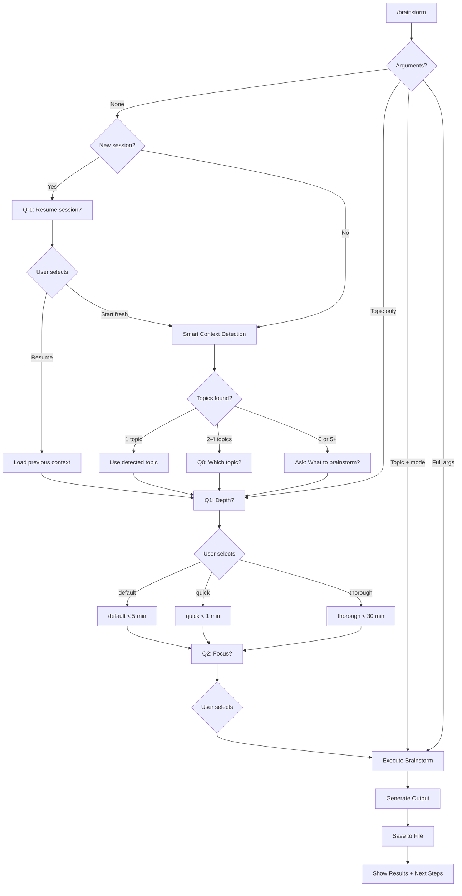

# Brainstorm Command UX Design

**Version:** 2.1.6
**Last Updated:** 2025-12-29
**Status:** Implemented

## Overview

The `/brainstorm` command provides ADHD-friendly brainstorming with smart context detection, interactive menus, and session continuity.

## Design Principles

| Principle | Implementation |
|-----------|----------------|
| **Reduce friction** | Smart context detection, session resume |
| **Respect constraints** | AskUserQuestion max 4 options |
| **Progressive disclosure** | Show menus only when needed |
| **Session continuity** | Resume previous brainstorms |

---

## User Flows

### Flow 1: Direct Invocation (Skip Menus)

```
/brainstorm quick feature "auth system"
         ↓
    Execute immediately
```

**When:** User knows exactly what they want.

### Flow 2: Topic Only (Show Menus)

```
/brainstorm "auth system"
         ↓
    Q1: Depth? (default/quick/thorough)
         ↓
    Q2: Focus? (auto-detect/feature/arch/backend)
         ↓
    Execute with selections
```

**When:** User has a topic but wants to refine approach.

### Flow 3: No Arguments, Existing Conversation

```
/brainstorm
         ↓
    Smart Context Detection
         ↓
    [1 topic]     → Use it, skip to Q1
    [2-4 topics]  → Q0: Which topic?
    [0 or 5+]     → Ask free-form
         ↓
    Q1: Depth? → Q2: Focus? → Execute
```

**When:** User is mid-conversation, wants to brainstorm current topic.

### Flow 4: No Arguments, New Session

```
/brainstorm (new session)
         ↓
    Q-1: Resume session?
      ○ Resume: [latest topic] - [project] - [time]
      ○ Resume: [2nd latest] - [project] - [time]
      ○ Start fresh
         ↓
    [Resume] → Load context → Q1 → Q2 → Execute
    [Fresh]  → Smart detect → Q1 → Q2 → Execute
```

**When:** User starts new session, may want to continue previous work.

---

## Question Design

### Constraints (AskUserQuestion)

| Constraint | Value |
|------------|-------|
| Max options per question | 4 |
| Max questions per call | 4 |
| "Other" option | Automatically added by tool |

### Q-1: Session Resume (New Session Only)

```yaml
question: "Continue from a previous session or start fresh?"
header: "Session"
multiSelect: false
options:
  - label: "Resume: [topic]"
    description: "[project] - [time ago]"
  - label: "Resume: [topic 2]"
    description: "[project] - [time ago]"
  - label: "Start fresh"
    description: "New brainstorm in current context"
```

### Q0: Topic Selection (Multiple Topics Detected)

```yaml
question: "Which topic should we brainstorm?"
header: "Topic"
multiSelect: false
options:
  - label: "[Topic from conversation]"
    description: "Mentioned earlier in chat"
  - label: "[Topic from git branch]"
    description: "Current branch: feature/xyz"
  - label: "[Topic from .STATUS]"
    description: "Current project focus"
```

### Q1: Depth Selection

```yaml
question: "How deep should the analysis be?"
header: "Depth"
multiSelect: false
options:
  - label: "default (Recommended)"
    description: "< 5 min, comprehensive with options"
  - label: "quick"
    description: "< 1 min, fast ideation, no agents"
  - label: "thorough"
    description: "< 30 min, 2-4 agents for deep analysis"
```

### Q2: Focus Selection

```yaml
question: "What's the focus area?"
header: "Focus"
multiSelect: false
options:
  - label: "auto-detect (Recommended)"
    description: "Detect from project context"
  - label: "feature"
    description: "User stories, MVP scope"
  - label: "architecture"
    description: "System design, diagrams"
  - label: "backend"
    description: "API, database, auth"
```

**Note:** `frontend`, `design`, `devops` available via "Other" option.

---

## Context Detection

### Detection Sources

| Source | What to look for | Priority |
|--------|------------------|----------|
| **Previous sessions** | Recent brainstorm sessions (new session only) | Highest |
| **Conversation** | Topics discussed, problems mentioned | High |
| **Project .STATUS** | Current task, next steps | High |
| **Git branch** | Branch name (e.g., `feature/oauth`) | Medium |
| **Recent commits** | Commit messages from last 24h | Medium |

### Detection Logic

```python
def detect_brainstorm_context():
    # 1. Check if new session
    if is_new_session():
        sessions = get_recent_brainstorm_sessions()
        if sessions:
            return ask_resume_or_fresh(sessions)

    # 2. Detect topics from context
    topics = []
    topics += extract_from_conversation()
    topics += extract_from_status_file()
    topics += extract_from_git_branch()
    topics += extract_from_recent_commits()

    # 3. Deduplicate and rank
    topics = dedupe_and_rank(topics)

    # 4. Decision
    if len(topics) == 1:
        return topics[0]  # Use directly
    elif 2 <= len(topics) <= 4:
        return ask_which_topic(topics)
    else:
        return ask_freeform()
```

---

## Flowchart



---

## Time Budgets

| Depth | Budget | Agents | Output |
|-------|--------|--------|--------|
| **quick** | < 60s (MUST) | None | 5-7 ideas, quick wins |
| **default** | < 300s (SHOULD) | Optional | Comprehensive with options |
| **thorough** | < 1800s (MAX) | 2-4 | Deep analysis with synthesis |

---

## Output Format

### Terminal Output

```
┌─────────────────────────────────────────────────────────────┐
│ 🧠 BRAINSTORM: [Topic]                                      │
│ Mode: [mode] │ Depth: [depth] │ Duration: [time]            │
├─────────────────────────────────────────────────────────────┤
│                                                             │
│ ## Quick Wins (< 30 min each)                               │
│   ⚡ [Action 1] - [Benefit]                                  │
│   ⚡ [Action 2] - [Benefit]                                  │
│                                                             │
│ ## Medium Effort (1-2 hours)                                │
│   □ [Task with clear outcome]                               │
│                                                             │
│ ## Long-term (Future sessions)                              │
│   □ [Strategic item]                                        │
│                                                             │
│ ## Recommended Path                                         │
│   → [Clear recommendation with reasoning]                   │
│                                                             │
├─────────────────────────────────────────────────────────────┤
│ ✅ Completed in [time]s (within [depth] budget)             │
└─────────────────────────────────────────────────────────────┘
```

### Footer

```
┌─────────────────────────────────────────────────────────────┐
│ 💡 Quick tip:                                               │
│    /brainstorm quick feature auth  ← skip menus             │
│                                                             │
│ 🔗 Related commands:                                        │
│    /workflow:focus  /workflow:next  /workflow:done          │
│                                                             │
│ 📄 Saved: BRAINSTORM-[topic]-[date].md                      │
└─────────────────────────────────────────────────────────────┘
```

---

## Version History

| Version | Date | Changes |
|---------|------|---------|
| 2.1.6 | 2025-12-29 | Session resume for new sessions |
| 2.1.5 | 2025-12-29 | Smart context detection |
| 2.1.4 | 2025-12-29 | Topic first, then menus |
| 2.1.3 | 2025-12-29 | Two-question flow (4-option limit) |
| 2.1.2 | 2025-12-29 | Tab-completion menu spec (aspirational) |
| 2.1.0 | 2025-12-29 | Interactive menu UX |
| 2.0.0 | 2025-12-24 | Time budgets, agent delegation |

---

## Design Decisions

### Why Two Questions Instead of One?

AskUserQuestion has a 4-option limit. Combining depth (3) + focus (6) = 9 options exceeds the limit. Two sequential questions stay within bounds.

### Why Depth Before Focus?

Depth affects the entire brainstorm experience (time, agents). Focus is secondary refinement. Users think "how much time do I have?" before "what angle?".

### Why Session Resume?

ADHD users often context-switch. Session resume reduces cognitive load of remembering "where was I?" and enables seamless continuation.

### Why Smart Detection?

Typing `/brainstorm` should "just work" in most cases. Asking for topic every time adds friction. Smart detection uses available context to reduce questions.

---

## Future Considerations

- **Folder-based sub-commands:** `brainstorm/quick.md` for true Tab dropdown
- **Session storage:** Persist brainstorm results for resume feature
- **Multi-select depth+focus:** Combine in single question if limit increases
- **Voice input:** "Hey Claude, brainstorm auth" → same flow
